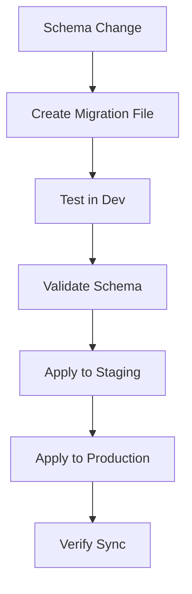

# GameForge Database Schema Synchronization Guide

## 🎯 Overview

This guide covers the complete setup and synchronization of GameForge database schemas between development and production environments.

## 📋 Current Schema Status

✅ **Development Database (Ready)**
- **Database**: `gameforge_dev`
- **Tables**: 15 (13 data tables + 2 views)
- **Extensions**: uuid-ossp, citext, pg_trgm
- **Custom Types**: 6 enums (user_role, project_status, asset_type, etc.)
- **Migration Tracking**: Installed and operational

✅ **Production Schema (Generated)**
- **File**: `gameforge_production_schema.sql`
- **Size**: ~55KB
- **Tables**: 14 tables + indexes
- **Ready for deployment**

## 🛠️ Schema Synchronization Tools

### 1. Migration Tracking System
**File**: `migrations/000_migration_system.sql`
- Tracks all schema changes
- Provides version control for database structure
- Prevents duplicate migrations
- Records execution time and metadata

### 2. Schema Sync Script
**File**: `scripts/schema-sync.ps1`
- Compares dev vs prod schemas
- Applies individual migrations
- Validates database structure
- Dumps clean schemas

### 3. Production Schema Generator
**File**: `scripts/generate-production-schema.ps1`
- Creates production-ready schema from dev
- Excludes test data and debug configurations
- Optimizes for production deployment

## 🚀 Deployment Process

### Phase 1: Production Database Setup

#### Step 1: Create Production Database
```sql
-- Connect as postgres superuser
CREATE USER gameforge_user WITH PASSWORD 'SECURE_PRODUCTION_PASSWORD';
CREATE DATABASE gameforge_prod OWNER gameforge_user;
GRANT ALL PRIVILEGES ON DATABASE gameforge_prod TO gameforge_user;
```

#### Step 2: Apply Production Schema
```powershell
# Copy schema file to production server
scp gameforge_production_schema.sql user@prod-server:/tmp/

# Apply schema
psql -U postgres -h prod-server -d gameforge_prod -f gameforge_production_schema.sql
```

#### Step 3: Verify Installation
```powershell
# Use the schema-sync tool
.\scripts\schema-sync.ps1 -Environment prod -Action validate
```

### Phase 2: Environment Configuration

#### Development Environment
**File**: `.env.database` (already configured)
```bash
DB_HOST=localhost
DB_PORT=5432
DB_NAME=gameforge_dev
DB_USER=gameforge_user
DB_PASSWORD=securepassword
```

#### Production Environment
**File**: `.env.production` (create from template)
```bash
DB_HOST=your-prod-host
DB_PORT=5432
DB_NAME=gameforge_prod
DB_USER=gameforge_user
DB_PASSWORD=YOUR_SECURE_PROD_PASSWORD
DB_SSL_MODE=require
```

### Phase 3: Migration Management

#### Creating New Migrations
```powershell
# Create new migration file
# Format: migrations/XXX_descriptive_name.sql

# Example: migrations/003_add_user_notifications.sql
BEGIN;

-- Add new column
ALTER TABLE users ADD COLUMN notifications_enabled BOOLEAN DEFAULT true;

-- Record migration
SELECT record_migration(
    '003_add_user_notifications',
    'Add notifications preference to users',
    'sha256_checksum',
    'migrations/003_add_user_notifications.sql'
);

COMMIT;
```

#### Applying Migrations
```powershell
# Apply to development
.\scripts\schema-sync.ps1 -Environment dev -Action migrate -MigrationFile "migrations/003_add_user_notifications.sql"

# Apply to production  
.\scripts\schema-sync.ps1 -Environment prod -Action migrate -MigrationFile "migrations/003_add_user_notifications.sql"
```

#### Schema Comparison
```powershell
# Compare dev vs prod schemas
.\scripts\schema-sync.ps1 -Environment dev -Action compare
```

## 🔄 Ongoing Synchronization Workflow

### Daily Development Workflow
1. **Develop** schema changes in development
2. **Create migration** files for changes
3. **Test migrations** in development
4. **Validate** with schema-sync tool
5. **Apply to staging** (if available)
6. **Deploy to production** during maintenance window

### Schema Change Process


## 📊 Validation Commands

### Check Current Schema Status
```powershell
# Development
.\scripts\schema-sync.ps1 -Environment dev -Action validate

# Production
.\scripts\schema-sync.ps1 -Environment prod -Action validate
```

### Export Schema for Backup
```powershell
# Export development schema
.\scripts\schema-sync.ps1 -Environment dev -Action dump-schema

# Export production schema
.\scripts\schema-sync.ps1 -Environment prod -Action dump-schema
```

### Migration Status
```sql
-- Check applied migrations
SELECT * FROM migration_status ORDER BY version;

-- Check for pending migrations
SELECT version, description 
FROM migration_status 
WHERE status = 'PENDING';
```

## 🔒 Security Considerations

### Production Security
- ✅ Use strong passwords for production database users
- ✅ Enable SSL/TLS connections (`DB_SSL_MODE=require`)
- ✅ Restrict database access by IP address
- ✅ Regular backup schedules
- ✅ Audit log monitoring

### Migration Security
- ✅ Review all migration scripts before production deployment
- ✅ Test migrations in staging environment first
- ✅ Use transaction blocks for rollback capability
- ✅ Backup database before major schema changes

## 📁 File Structure Summary

```
GameForge/
├── .env.database                      # Dev database config
├── .env.production.template           # Prod config template
├── gameforge_production_schema.sql    # Generated prod schema
├── migrations/
│   ├── 000_migration_system.sql       # Migration tracking
│   ├── 001_initial_schema.sql         # Initial schema
│   └── 002_oauth_and_game_features.sql# OAuth features
└── scripts/
    ├── schema-sync.ps1                # Main sync tool
    └── generate-production-schema.ps1 # Schema generator
```

## 🎯 Next Steps

### Immediate Actions
1. ✅ **Migration system** installed in development
2. ✅ **Production schema** generated and ready
3. ✅ **Sync tools** created and tested
4. 🔄 **Apply to production** database
5. 🔄 **Configure production** environment

### Ongoing Maintenance
- **Weekly schema comparisons** between environments
- **Migration reviews** before production deployment
- **Backup verification** and restore testing
- **Performance monitoring** of schema changes

## 🚨 Emergency Procedures

### Schema Rollback
```sql
-- If migration fails, rollback transaction
ROLLBACK;

-- Remove migration record if needed
DELETE FROM schema_migrations WHERE version = 'failed_migration_version';
```

### Production Recovery
```powershell
# Restore from backup
pg_restore -U postgres -d gameforge_prod /path/to/backup.dump

# Re-apply latest migrations
.\scripts\schema-sync.ps1 -Environment prod -Action validate
```

---

## ✅ Schema Synchronization Complete!

Your GameForge database now has a robust schema synchronization system with:
- ✅ Migration tracking and version control
- ✅ Automated sync tools
- ✅ Production-ready schema generation
- ✅ Environment-specific configurations
- ✅ Validation and comparison capabilities