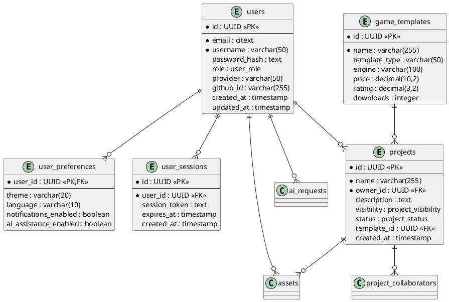

# GameForge Database ERD Generation Guide

## 🎯 Goal
Generate a comprehensive Entity Relationship Diagram (ERD) of the GameForge database schema using pgAdmin 4's built-in ERD tool.

## 📊 ERD Generation Steps in pgAdmin

### Step 1: Access ERD Tool
1. **Connect to GameForge Dev DB** in pgAdmin
2. **Expand the database** → gameforge_dev
3. **Right-click on "gameforge_dev"** database
4. **Select "Generate ERD"** from context menu

### Step 2: Configure ERD Settings
1. **Select Tables**: Include all 15 tables
   - ✅ users
   - ✅ user_preferences  
   - ✅ user_sessions
   - ✅ api_keys
   - ✅ projects
   - ✅ project_collaborators
   - ✅ game_templates
   - ✅ assets
   - ✅ ai_requests
   - ✅ ml_models
   - ✅ datasets
   - ✅ audit_logs
   - ✅ system_config
   - ✅ project_stats (view)
   - ✅ user_stats (view)

2. **Display Options**:
   - ✅ Show table names
   - ✅ Show column names
   - ✅ Show data types
   - ✅ Show primary keys
   - ✅ Show foreign keys
   - ✅ Show indexes (optional)

### Step 3: Organize Layout Logically

#### Recommended Layout Clusters:

**🧑‍💼 User Management Cluster (Top Left)**
- `users` (center)
- `user_preferences` (below users)
- `user_sessions` (right of users)
- `api_keys` (below user_sessions)

**🎮 Project Management Cluster (Top Right)**
- `projects` (center)
- `project_collaborators` (below projects)
- `game_templates` (right of projects)
- `project_stats` (view - below collaborators)

**📁 Asset Management Cluster (Bottom Left)**
- `assets` (center)
- `datasets` (below assets)
- `ml_models` (right of datasets)

**🔍 System Monitoring Cluster (Bottom Right)**
- `audit_logs` (center)
- `ai_requests` (above audit_logs)
- `system_config` (right of audit_logs)
- `user_stats` (view - above system_config)

### Step 4: Highlight Key Relationships

#### Primary Relationships to Emphasize:
1. **users** → **projects** (one-to-many via owner_id)
2. **users** → **user_preferences** (one-to-one via user_id)
3. **users** → **user_sessions** (one-to-many via user_id)
4. **users** → **api_keys** (one-to-many via user_id)
5. **projects** → **project_collaborators** (one-to-many via project_id)
6. **projects** → **assets** (one-to-many via project_id)
7. **users** → **assets** (one-to-many via uploaded_by)
8. **users** → **ai_requests** (one-to-many via user_id)
9. **users** → **audit_logs** (one-to-many via user_id)

### Step 5: Export ERD
1. **Click "Save" or "Export"** in ERD tool
2. **Choose format**: PNG (for documentation)
3. **Set resolution**: 300 DPI (high quality)
4. **Set size**: Large (for readability)
5. **Save as**: `docs/schema-diagram.png`

## 📋 ERD Documentation Checklist

### Visual Elements to Include:
- ✅ **Table Names**: Clear and readable
- ✅ **Column Names**: All columns visible
- ✅ **Data Types**: PostgreSQL types shown
- ✅ **Primary Keys**: Highlighted (usually bold/key icon)
- ✅ **Foreign Keys**: Connected with relationship lines
- ✅ **Indexes**: Key indexes shown
- ✅ **Constraints**: Unique constraints visible

### Relationship Lines:
- **Solid lines**: Required foreign keys (NOT NULL)
- **Dashed lines**: Optional foreign keys (NULL allowed)
- **Crow's foot**: Many side of relationship
- **Single line**: One side of relationship

### Color Coding (if available):
- **Blue**: User management tables
- **Green**: Project management tables
- **Orange**: Asset management tables
- **Red**: System/monitoring tables

## 🔧 Alternative: Manual ERD Creation

If pgAdmin's ERD tool has limitations, you can also create the diagram using:

### Tools:
1. **draw.io** (free, web-based)
2. **Lucidchart** (professional)
3. **DbDiagram.io** (database-specific)
4. **PlantUML** (code-based)

### Manual ERD Code (PlantUML format):


## 📊 ERD Analysis Checklist

### Verify in Generated ERD:
1. **All 15 tables present**
2. **Primary keys clearly marked**
3. **Foreign key relationships visible**
4. **Data types displayed**
5. **Indexes shown (where important)**
6. **Relationship cardinality correct**
7. **Layout is logical and readable**

### Key Relationships to Verify:
- **1:1** - users ↔ user_preferences
- **1:Many** - users → projects
- **1:Many** - users → assets
- **1:Many** - projects → project_collaborators
- **Many:1** - projects → game_templates

## 💾 File Organization

```
docs/
├── schema-diagram.png          # Main ERD export
├── schema-diagram-large.png    # High-resolution version  
├── schema-diagram.svg          # Vector format (if available)
├── erd-generation-guide.md     # This file
└── table-relationships.md      # Detailed relationship docs
```

## 🔍 ERD Review Process

### Team Review Checklist:
1. **Accuracy**: All tables and relationships correct
2. **Completeness**: No missing tables or important columns
3. **Clarity**: Layout is easy to understand
4. **Documentation**: Proper labeling and legends
5. **Accessibility**: High enough resolution for viewing

### Distribution:
- **Development Team**: For understanding database structure
- **New Developers**: Onboarding documentation
- **Product Team**: Understanding data relationships
- **Documentation Wiki**: Central knowledge base